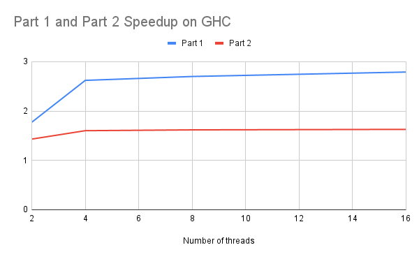
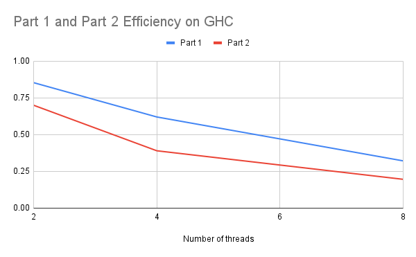
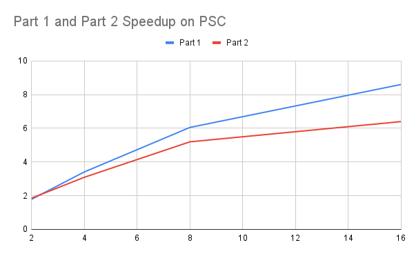
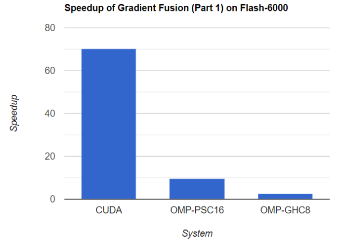
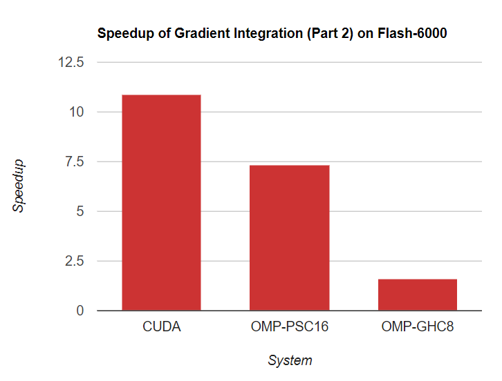
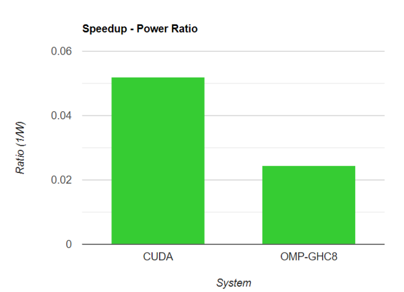

# Efficient Parallel Gradient Domain Image Fusion Systems

Teammates: Lichen Jin, Jiuzhi Yu

URL: https://arceus48.github.io/15618-Proposal/

## Summary
For this project, we implemented the conjugate gradient image integration algorithm for the Image Gradient Fusion task on GPU and multi-core CPU platforms. We benchmarked the performance on OpenMP and CUDA with different sizes of inputs on the GHC machine with a Core i7-9700 CPU and RTX 2080 GPU. We demonstrated that the image gradient fusion tasks perform better on a GPU environment than a multi-core CPU due to its memory-bounded and low divergence task nature.

## Background
Gradient image fusion is a general and useful task we use in image editing. This algorithm is useful to combine two images with different desirable properties and generate a result image with good characteristics from both inputs.

One example is to combine an ambient image and a flash image on the same objects. As shown in the example here, the ambient image shows many details for the picture with leaves, but no facial features for the woman. On the contrary, the flash image clearly shows the face of the woman, but leaves a flashing spot on the picture.

<em>Example ambient image</em>

<em>Example flash image</em>

By using the gradient image fusion algorithm, we can generate a result image which combines the good parts of both images with enough details for both the image and the woman, as the figure shown below.

<em>Example result image</em>

This algorithm uses some image processing algorithms including Laplacian convolution, vector field integration, etc. A variant gradient descent algorithm called conjugate gradient descent is used to integrate the image to get the final result. Though conjugate gradient descent proves to be a good solver to the problem, the algorithm can take a great number of iterations to converge and hence is very slow if executed sequentially. The algorithm is as the pseudo-code below:

We find that most of the algorithms are per-pixel operations or the Laplacian convolution. So the computation-intensive algorithm can be well parallelized if divided by pixel data. Specifically, all per-pixel arithmetics and convolutions can be well parallelized except for the serialized part of dot product and start/end of each iteration. Therefore, it is worth exploring the performance of various parallel frameworks on various architectures including GPU and multi-core CPU.

For this algorithm, the inputs are two images and some parameters including maximum iterations, error bound etc. The output is a fused image. For storing the image data, we used a two-dimensional array consisting of three one-dimensional arrays, each representing one color channel (RGB). Each one-dimensional array contains all the values for all pixels with the range from 0 to 1. Most of the computation done on the data are vector operations including vector addition, subtraction, scalar multiplication, dot product, and convolutions. The most computationally expensive part is the conjugate gradient descent part. Each iteration involves many vector calculations and two reductions, requiring synchronization among all computation units. This part should benefit from parallelization.

If we take a closer look at the iterations, it involves many data accesses, computation and synchronization. For data accesses, each vector operation requires a complete pass for all the pixel data. If the image has a lot of pixels, then memory accesses will take up much time. For computation, vector operations are the major components and can be parallelized easily. For synchronization, each dot product requires synchronization of all computational units to get the current loss to determine whether to stop execution or not. Synchronization can also be costly.

With all the introduction above, we think this algorithm is memory-bound and requires much inherent communication. We would like to explore the suitable platform for this kind of task on a multi-core CPU environment and on GPU.

## Approach

### Environment Setup
We implemented all three versions (sequential, OpenMP, CUDA) in C++. All experiments were run on the GHC machine with Intel Core i7-9700 and RTX2080.

### Serial implementation
The serial implementation has been improved over time. For the first version, to maximize code reuse and make codes clean, we created a function for each vector operation, including vector addition, subtraction, dot product, etc. We translated the pseudo code listed above to the C++ program with these vector operation functions. But the performance is bad, because each vector operation requires scanning the whole vector from beginning to end, making the arithmetic intensity very low. Most of the time is spent on memory accesses.

To resolve this problem, in the second version, we try to maximize the data reuse. We got rid of the vector operation functions, but tried to do more computation with one data access. We improved the sequential performance by 1.5 times with this change.

In the third version, we realized that the laplacian convolution can be optimized. The original version of code works for a general kernel, just do elementary-multiply the data with the kernel and sum up to get the results. But for the 3 by 3 laplacian kernel, only 5 out of the 9 elements are non-zero. So we changed the code to access only the non-zero elements to reduce data accesses. We also changed the computation order to increase data reuse. After the third version, we have already achieved a satisfactory arithmetic intensity for the algorithm.

For the third version, the program consists of two parts. The first part calculates the gradient for two input images and computes the fused gradient. This part requires no synchronization. The second part integrates the fused gradient to the output image. This part needs synchronization and requires much longer time to compute.

### OpenMP
For the OpenMP version, we adopted the data-parallel programming model, parallelizing all the vector operations.

The first version of OpenMP was implemented on top of the first serial implementation (before the second and third version of the serial implementation came out). We just made every function parallel with parallel for. We also used the “shared” mode to remove useless data copy. This version performed badly, with a speedup around 1.95x for 8 threads.

The second version of OpenMP was also built on top of the first serial implementation. The first version used parallel for, which has an inherent synchronization after each for loop. But for our computation, many for loops can be executed together without synchronization. Therefore, we removed the implicit barrier and added barriers explicitly. But the performance did not improve, so we switched back to using parallel for. We also tried changing the scheduling algorithm, from static to dynamic. But because the workload is already evenly distributed among all threads, using static should be the best choice with the least scheduling overhead. Then we realized that the performance was bad due to the low arithmetic intensity, so we changed the serial implementation.

The third version of OpenMP was built on top of the third serial implementation. The speedup now was a little bit higher than the previous two cases, around 2.00x for 8 threads. Even with a higher arithmetic intensity, the algorithm itself is still memory-bound and most of the time is also spent on fetching the data (shown in the next section). Moreover, many inherent communication from reductions added overhead to the execution, resulting in the poor speedup. We will show all detailed results in the next section.

### CUDA
Because image processing tasks can be naturally mapped to the GPU SMM cores, we also break down the task with data parallelism, into 2D blocks of 32X32. Most of the operations are convolutions or per pixel arithmetics and can be well broken down into the thread blocks, but the main challenge occurs when trying to do ReduceSum for calculating the dot products. For this part we implement the All Reduction as a special kernel; it recursively launches to calculate the sub summation of elements within each thread block until all values are added up within only one thread block. For each iteration in the image integration stage, the task is separated into several stages, by All Reduction as the data dependency barrier.

For our initial version, we have a straightforward implementation of AllReduction by AtomicAdd into one value within the whole thread block; we also strictly follow the formula in the pseudo code by allocating global buffers for each math symbol. Such a design suffers from synchronization when calculating the block sum, and does not have good data locality by having all data in global memory. The initial version 

So we optimized the next version. For the block reduction, we implement the reduction in a tree-like way, similar to the exclusive scan we have in assignment 2, so threads do not add values to the same address as much as possible. Also, we use local variables and shared memory for intermediate results, which increases data locality and decreases the global buffer allocation. Our results show that in all cases we have for experiment the CUDA implementation has reached around 10x speedup on the RTX 2080 in GHC machine. That speedup is much better compared to OpenMP and is acceptable as a working solution, but still far from a perfect speedup compared to the maximum threads a GPU can have. We will show the detailed results and talk about the speedup together with CPU in the next sections.

## Results

Experiment design
For our experiments, we plan to evaluate the two platforms on both strong scaling and weak scaling abilities. Therefore, we prepared five input sets, each consisting of one ambient image and flash image (That high resolution image pair is taken by Nikon D3500 in the apartment). The image size (length and width) for the five input sets are different, (750, 4000), (1500, 4000), (3000, 4000), (4500, 4000), (6000, 4000). Each image consists of three color channels, RGB respectively. For each set of images, we ran the code for three times and calculated the average runtime. For both CPU and GPU, we run the program on the GHC machine 418/618 has given (8-core i7 9700 and RTX 2080); in addition to that we also run OpenMP on the CPU machine of PSC-Bridge 2.

For strong scaling, we used the same input for all three code versions, and measured the running time. We calculated the speedup as: serial execution time / parallel execution time. We hope that the speedup should be proportional to the number of computation units.

For weak scaling, we used different input sizes for different cases. For OpenMP, we feed the (750, 4000) input set to the sequential case, (1500, 4000) to the case with 2 threads, (3000, 4000) to the case with 4 threads, (4500, 4000) to 6 threads, (6000, 4000) to 8 threads. We calculated the efficiency as: serial execution time / parallel execution time. In the best case, the efficiency should remain close to 1 for all these 5 cases. 

### Serial performance breakdown
We timed the two components separately and computed speedup and efficiency for these two components. Most of the time is spent on part 2 instead of part 1. To provide an overall idea on the running time breakdown, for the (750, 4000) image set, the serial running time is 402 ms for part 1 and 31832 ms for part 2.

### OpenMP results
Strong Scaling: We first computed the speedup by comparing the performance on the image set (6000,4000) for the thread numbers: 2, 4, 8, 16 on the GHC machine. The overall speedup is shown in the graph below.

Both the speedups are much lower than the number of threads provided. For part 1, because there is no synchronization, the speedup is higher than part 2. For part 2, the highest speedup we get is around 1.62, much lower than the number of cores (8).

Weak Scaling: Then we calculated the efficiency. We measured the time for 1 thread on (750, 4000), 2 threads on (1500, 4000), 4 threads on (3000, 4000) and 8 threads on (6000, 4000). The idea is that the work for each thread is the same for all cases. If the program can scale, then the efficiency calculated by time of 1 thread divided by time of n threads should be close to 1. The graph is shown below.

For the weak scaling case, the efficiency is decreasing when we increase the number of threads. It shows the poor scaling result. Part 1 is higher than part 2 also due to no synchronization required.

Then the question is what reasons caused the poor scaling for the OpenMP version. We think there are two reasons. First, this program is memory intensive. Each operation requires scanning 2-3 arrays with the size equal to the number of pixels. For images, the number of pixels are large and the array cannot fit into the cache. Due to this reason, there will be many cache misses and many unavoidable memory accesses. Even though using multiple cores and speedup calculation, because the memory bandwidth is limited, we cannot make the program even faster if the memory bandwidth is already used up. Second, there are many inherent communications. For part 1, there is no synchronization so the scalability is better than part 2. But for part 2, each iteration requires 2 synchronizations, and we need around 800 iterations for the integration process to converge. This incurs much overhead.

We also verified our idea on the PSC machine, which has 8 memory channels,indicating a much larger memory bandwidth. With a larger memory bandwidth, a much larger speedup and efficiency compared with the results on GHC machines can be realized. The speedup and efficiency graphs are reproduced for the results on the PSC machine.

The speedup is much higher than the result on GHC despite not being close to perfect speedup. For efficiency, the efficiency is much more stable than the result on GHC as well. With these two results, we verified that the major bottleneck for the GHC machine is memory access. We also tried a case where all the images can fit within the cache, meaning there will be no bottleneck on memory bandwidth. The speedup is provided here as well.

It shows almost a perfect speedup for part 2. The speedup for part 1 is limited because the computation here is much less, so the time is also dominated by memory accesses. With more threads, the memory access time for the array won’t be improved much.

### CUDA results
In contrast to CPU OpenMP, we do not adjust the parallelism for CUDA solution. Instead we compare the best speedup of OpenMP on GHC/PSC with GPU, for both Part 1 and Part 2 of the gradient domain algorithm. Here is the speed up comparisons on the largest task, our custom (6000, 4000) flash pair images taken by Nikon D3500.

Though PSC has the highest speedup for small data sets like Museum, CUDA on RTX 2080 eventually has the highest performance on large data sets like high resolution images. In addition, CUDA implementation has a quite stable speedup across different data sets (70x for part 1 and 11x for part 2), which demonstrates nice scalability.

In addition, rather than analyzing parallelism efficiency, we measure the energy efficiency to the speedup. Here is the comparison of speedup - power ratio of CUDA and OMP-PSC16 on the GHC machine, for Flash-6000 (We assume that i7-9700 is 65W and RTX 2020 is 210W) for the whole task (Part1 + Part2):

So the GPU has more than twice power efficiency when handling the photo task, which is the kind of task tailored for GPUs.

### Execution Platform Discussions
We find that OpenMP is not realizing perfect speedup on GHC/PSC due to limited memory bandwidth (10-20G on GHC, PSC is much better because it has super large memory bandwidth). But on GPU, the memory bandwidth is much larger, around 448GB. So CUDA will not be limited by that. Also, all the operations (vector operations) show a very small divergence, suitable for CUDA SIMD warp execution. Also the nature of image editing tasks comes with good data parallelism which is inherently suitable for GPUs. Therefore, the GPU solution finally reaches good performance. Still it is not reaching perfect speedup, that’s because the nature of all reduction is not very parallelizable. (The complexity can only be distributed to log scale)
The task we implement in this project is an image processing task, and inherently very data parallel for most of the part. As a result, the heterogeneous architecture of GPU and CUDA is well tailored for such tasks, reaching decent speedup with very good power efficiency. That helps us understand the efficiency of specify architectures better.

## References
1. Amit Agrawal, Ramesh Raskar, Shree K. Nayar, and Yuanzhen Li. 2005. Removing photography artifacts using gradient projection and flash-exposure sampling. ACM Trans. Graph. 24, 3 (July 2005), 828–835. https://doi.org/10.1145/1073204.1073269
2. Georg Petschnigg, Richard Szeliski, Maneesh Agrawala, Michael Cohen, Hugues Hoppe, and Kentaro Toyama. 2004. Digital photography with flash and no-flash image pairs. ACM Trans. Graph. 23, 3 (August 2004), 664–672. https://doi.org/10.1145/1015706.1015777
3. Jeff Bolz, Ian Farmer, Eitan Grinspun, and Peter Schröder. 2003. Sparse matrix solvers on the GPU: conjugate gradients and multigrid. ACM Trans. Graph. 22, 3 (July 2003), 917–924. https://doi.org/10.1145/882262.882364
4. James McCann and Nancy S. Pollard. 2008. Real-time gradient-domain painting. ACM Trans. Graph. 27, 3 (August 2008), 1–7. https://doi.org/10.1145/1360612.1360692
5. Patrick Pérez, Michel Gangnet, and Andrew Blake. 2003. Poisson image editing. In ACM SIGGRAPH 2003 Papers (SIGGRAPH '03). Association for Computing Machinery, New York, NY, USA, 313–318. https://doi.org/10.1145/1201775.882269
6. Computational Photography (CMU 15-663). 2022. http://graphics.cs.cmu.edu/courses/15-463/.

## Work distribution

Jiuzhi: Serial and OpenMP implementations and experiments (50%)

Lichen: CUDA implementation and experiments (50%)

