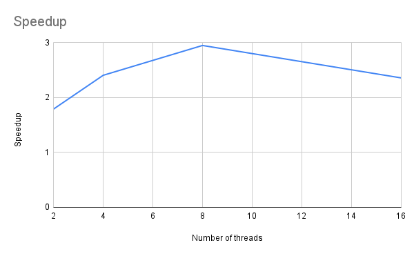
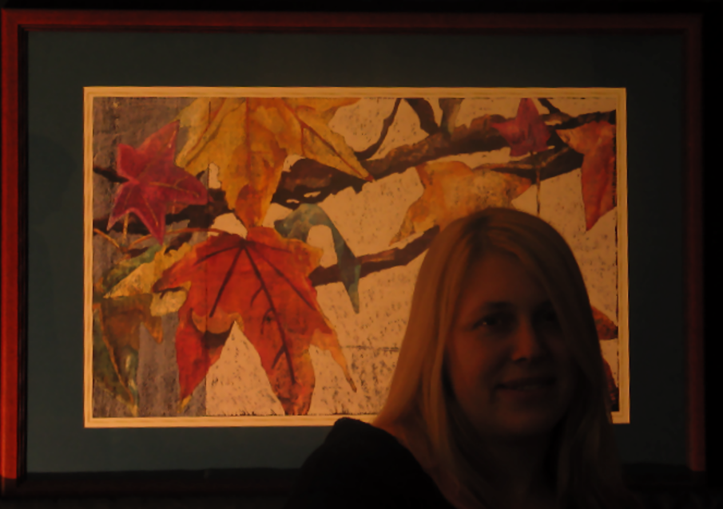
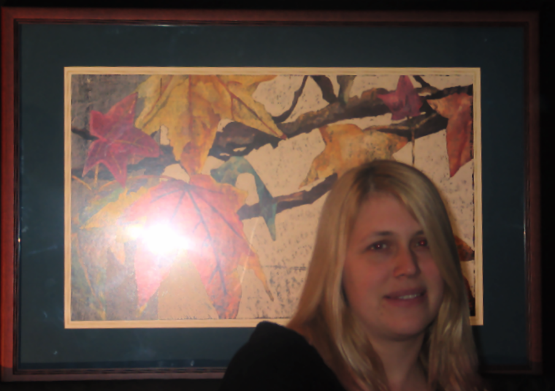
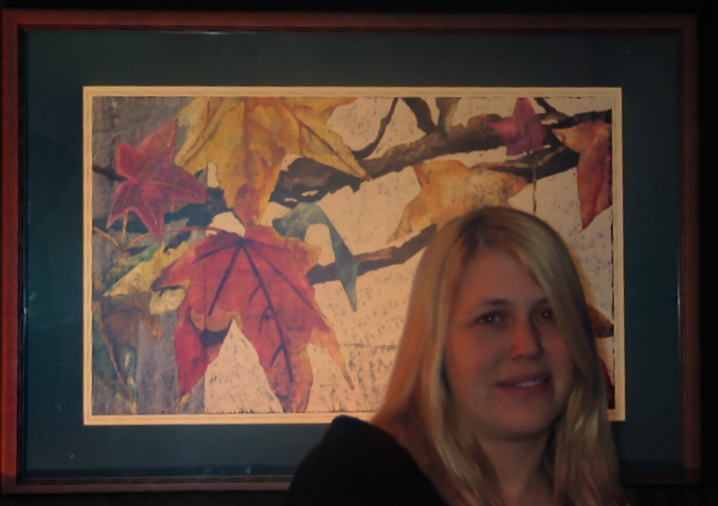

# Efficient Parallel Gradient Domain Image Fusion Systems

Teammates: Lichen Jin, Jiuzhi Yu

URL: https://arceus48.github.io/15618-Proposal/

## Current progress
We first learned about the algorithm through the slides from 15-663 [6]. We further studied the algorithm for image fusion from the paper [1] and conjugate gradient descent from the paper [3]. After that, we implemented the image fusion algorithm in C++ with OpenCV for image reading and writing. We also optimized the sequential program to minimize the overhead.

With a working sequential baseline, we implemented the OpenMP version running on a multi-core CPU environment. We are still working on optimizing the OpenMP version to achieve a better speedup.

For experiment data (images), we now collected the images used in the paper [3] to validate our implementations and get preliminary speedup for OpenMP. We plan to collect more images with our camera for experiments.

The GPU implementation is different compared to the default sequential logic, and we are developing in progress along the sub tasks we have broken down in the schedule.

## Goals
Here are the goals we are doing at the current stage.
1. As we have planned in the proposal, we plan to implement a parallel gradient domain for a GPU version (CUDA) and a multi-core CPU version (OpenMP). After that we are performing a serious performance analysis on our photograph data sets. We are pursuing this goal with the completed OpenMP implementation and some preliminary results.
2. Given that we have got some preliminary results on OpenMP, we have diagnosed the not-so-good speedup and will optimize it for less synchronizations. That is naturally an extra goal we plan to achieve because speedup is critical for the functionality of this application.
3. With regard to the goal we hope to achieve, we haven’t made progress yet, due to the development difficulty of the MPI-like programming framework.

## Deliverables at poster session
We plan to have two forms of deliverables for the poster session:
1. We are having a demo with regard to what image fusion task does and how it can be done very fast with parallel implementations.
2. As we are having thorough performance analysis treating it as a parallel problem, we are going to have the result charts and tables on our poster.

## Preliminary results
The current results are:
1. Correctly implement the image fusion algorithm to generate an image with useful features from both the ambient image and the flash image. We provide an example at the end of this report.
2. Implemented the OpenMP version and calculated the speedup for 2, 4, 8, and 16 threads on a local machine with an Intel Core i7-10875H (8 cores, 16 threads). The code was built and run in Windows Subsystem for Linux (WSL). The speedup graph is attached below. The speedup here may also be influenced by our platform (WSL) and also other running processes in the operating system. We plan to move our tests to the GHC machine later to get a more accurate speedup.

## Issues and concerns
As we have stated in the goals section, the synchronization between workers can be a critical factor of how the speedup is. That is especially an issue in CUDA implementation of dot products. Although the paper introduces a recursive scan algorithm for better locality, we will try both that algorithm and a naive all reduction to see which one actually works better in CUDA, for very large photos.

## References
1. Amit Agrawal, Ramesh Raskar, Shree K. Nayar, and Yuanzhen Li. 2005. Removing photography artifacts using gradient projection and flash-exposure sampling. ACM Trans. Graph. 24, 3 (July 2005), 828–835. https://doi.org/10.1145/1073204.1073269
2. Georg Petschnigg, Richard Szeliski, Maneesh Agrawala, Michael Cohen, Hugues Hoppe, and Kentaro Toyama. 2004. Digital photography with flash and no-flash image pairs. ACM Trans. Graph. 23, 3 (August 2004), 664–672. https://doi.org/10.1145/1015706.1015777
3. Jeff Bolz, Ian Farmer, Eitan Grinspun, and Peter Schröder. 2003. Sparse matrix solvers on the GPU: conjugate gradients and multigrid. ACM Trans. Graph. 22, 3 (July 2003), 917–924. https://doi.org/10.1145/882262.882364
4. James McCann and Nancy S. Pollard. 2008. Real-time gradient-domain painting. ACM Trans. Graph. 27, 3 (August 2008), 1–7. https://doi.org/10.1145/1360612.1360692
5. Patrick Pérez, Michel Gangnet, and Andrew Blake. 2003. Poisson image editing. In ACM SIGGRAPH 2003 Papers (SIGGRAPH '03). Association for Computing Machinery, New York, NY, USA, 313–318. https://doi.org/10.1145/1201775.882269
6. Computational Photography (CMU 15-663). 2022. http://graphics.cs.cmu.edu/courses/15-463/.

## Schedule

| Week          | Task                                                                                                                                                                                                              |
|---------------|-------------------------------------------------------------------------------------------------------------------------------------------------------------------------------------------------------------------|
| 11.14 - 11.20 | 1. Study about the papers and understand the algorithm.  2. Work on the implementations on the serial version.                                                                                                          |
| 11.21 - 11.27 | 1. Optimize the serial version Start gathering images with different characteristics.                                                                                                                                |
| 11.28 - 12.1  | 1. Work on OpenMP implementations. 2. Get initial speedup of OpenMP implementations.                                                                                                                                    |
| 12.1 - 12.4   | 1. Work on the CUDA implementations (Lichen). 2. Optimize the OpenMP implementation (Jiuzhi). 3. Collect more images for experimentations (Lichen).                                                                        |
| 12.5 - 12.8   | 1. Optimize the CUDA implementation to achieve a better speedup (Lichen). 2. Move the code into the GHC machine for a more accurate experiment (Jiuzhi).                                                                |
| 12.8 - 12.11  | 1. Perform experiments on the three implementations on the GHC machine (Both). 2. Analyze the running time by calculating speedup. 3. Break down the time for each implementation to get more performance insights (Both). |
| 12.11 - 12.18 | 1. Work on the final report (Both). 2. Work on the project poster (Both).                                                                                                                                               |

## Appendix
Example ambient image

Example flash image

Example result image

